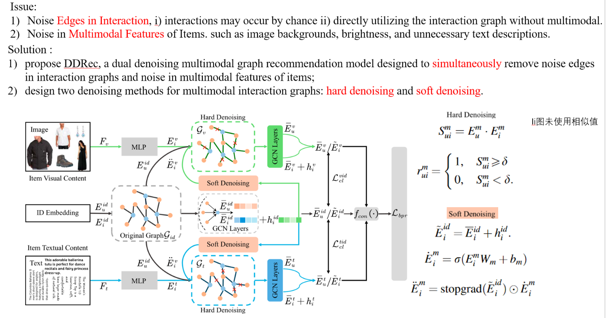
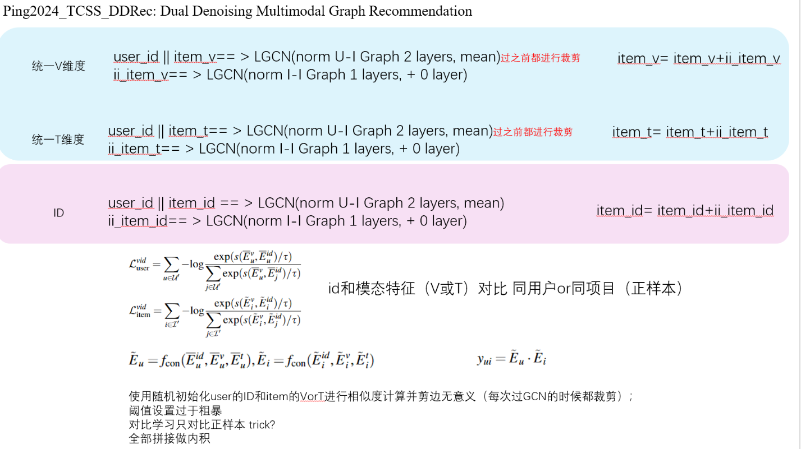

# DDRec

PyTorch implementation for IEEE Transactions on Computational Social Systems: [ [DDRec: Dual Denoising Multimodal Graph Recommendation](https://doi.org/10.1109/TCSS.2024.3490801)]

## Dependencies

- Python 3.8
- torch==1.11.0

## Datasets

```
├─ Data/: 
    ├── sports/
    ├── beauty/
    ├── clothing/
    ├── microlens/
```

## Citation

If you want to use our codes in your research, please cite:

```
@ARTICLE{10768190,
  author={Ping, Yuchao and Wang, Shuqin and Yang, Ziyi and He, Bugui and Zhou, Nan and Dong, Yongquan},
  journal={IEEE Transactions on Computational Social Systems}, 
  title={DDRec: Dual Denoising Multimodal Graph Recommendation}, 
  year={2024},
  volume={},
  number={},
  pages={1-15},
  keywords={Noise reduction;Noise;Visualization;Recommender systems;Convolution;Feature extraction;Contrastive learning;Collaboration;Semantics;Lattices;Graph convolution networks;multimodal recommendation system;self-supervised learning},
  doi={10.1109/TCSS.2024.3490801}}

```
