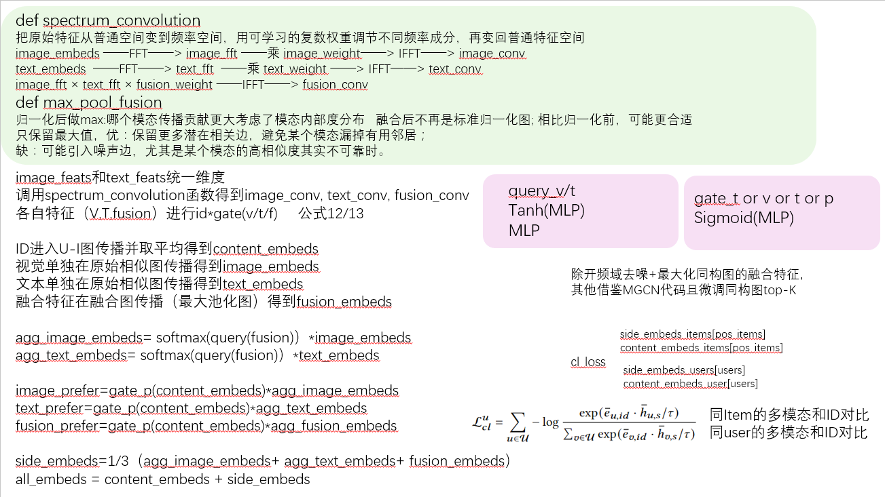

# Experiment Rerun
## paper report
| Dataset  | P@10 | P@20 |   R@10 |   R@20 |   N@10 |   N@20 |
| -------- | ---: | ---: | -----: | -----: | -----: | -----: |
| Baby     |    - |    - | 0.0680 | 0.1035 | 0.0365 | 0.0457 |
| Sports   |    - |    - | 0.0762 | 0.1142 | 0.0408 | 0.0506 |
| Clothing |    - |    - | 0.0659 | 0.0987 | 0.0360 | 0.0443 |


## real running
| Dataset        |   P@10 |   P@20 |   R@10 |   R@20 |   N@10 |   N@20 |
|----------------| -----: | -----: | -----: | -----: | -----: | -----: |
| Baby (A5000)   | 0.0074 | 0.0057 | 0.0670 | 0.1030 | 0.0366 | 0.0459 |
| Sports (A5000)   | 0.0083 | 0.0063 | 0.0753 | 0.1132 | 0.0411 | 0.0508 |
| Clothing (A5000)    | 0.0069 | 0.0051 | 0.0664 | 0.0987 | 0.0362 | 0.0444 |
| Clothing (L40) | 0.0069 | 0.0051 | 0.0664 | 0.0989 | 0.0362 | 0.0444 |
# SMORE: Spectrum-based Modality Representation Fusion Graph Convolutional Network for Multimodal Recommendation

<!-- PROJECT LOGO -->
<br />
<div align="center">
  <a href="https://github.com/kennethorq/SMORE">
    
  </a>
</div>

## Introduction

This is the Pytorch implementation for our WSDM 2025 paper:

>**[WSDM 2025]** Rongqing Kenneth Ong, Andy W. H Khong (2025). Spectrum-based Modality Representation Fusion Graph Convolutional Network for Multimodal Recommendation


## Enviroment Requirement
- Python 3.7
- Pytorch 1.13

## Dataset  
Download from Google Drive: [Baby/Sports/Clothing](https://drive.google.com/drive/folders/13cBy1EA_saTUuXxVllKgtfci2A09jyaG?usp=sharing)  
The data comprises text and image features extracted from Sentence-Transformers and CNN.  

## How to run
1. Place the downloaded data (e.g. `baby`) into the `data` directory.
2. Enter the `src` folder and execute the following command:  
`python main.py -m SMORE -d baby`  

Other parameters can be set either through the command line or by using the configuration files located in `configs/model/SMORE.yaml` and `configs/dataset/*.yaml`.

## Performance Comparison
<div align="center">
    
</div>


## Best hyperparameters for reproducibility
We present the optimal hyperparameters for SMORE to replicate the results shown in Table 2 of our paper:  

| Datasets  | n_ui_layers | n_layers | image_knn_k | text_knn_k | cl_loss | reg_weight | dropout_rate |
|-----------|-------------|----------|-------------|------------|---------|------------|--------------|
| Baby      | 4           | 1        | 40           | 15          | 0.01       | 1e-04          | 0.1            |
| Sports    | 3           | 1        | 10           | 10          | 0.03       | 1e-04          | 0            |
| Clothing  | 3           | 1        | 40           | 10          | 0.01       | 1e-05          | 0            |


## Citation
If you find SMORE useful in your research, please consider citing our [paper](https://arxiv.org/abs/2412.14978).
```
@article{ong2024spectrum,
  title={Spectrum-based Modality Representation Fusion Graph Convolutional Network for Multimodal Recommendation},
  author={Ong, Rongqing Kenneth and Khong, Andy WH},
  journal={arXiv preprint arXiv:2412.14978},
  year={2024}
}
```
This code is made available solely for academic research purposes.


## Acknowledgement
The structure of this code is inspired by the [MMRec](https://github.com/enoche/MMRec) framework. We acknowledge and appreciate their valuable contributions.
