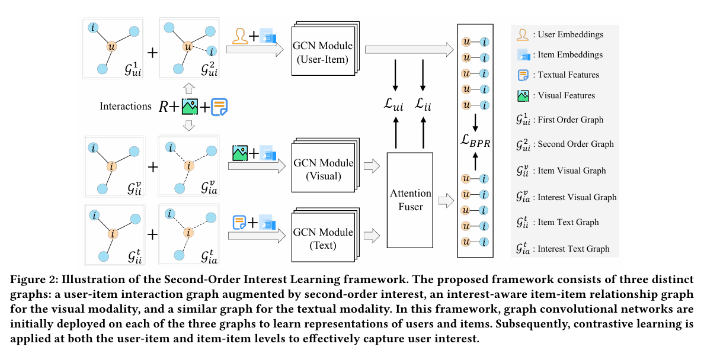

Note: 在解读源码过程中发现，代码与论文公式严重不符，上传仅释放本地存储空间


## [SOIL: Contrastive Second-Order Interest Learning for Multimodal Recommendation](./paper.pdf)

Hongzu Su, Jingjing Li, Fengling Li, Ke Lu, Lei Zhu 




Abstract: Mainstream multimodal recommender systems are designed to learn user interest by analyzing user-item interaction graphs. However, what they learn about user interest needs to be completed because historical interactions only record items that best match user interest (i.e., the first-order interest), while suboptimal items are absent. To fully exploit user interest, we propose a \textbf{S}econd-\textbf{O}rder \textbf{I}nterest \textbf{L}earning (\textbf{SOIL}) framework to retrieve second-order interest from unrecorded suboptimal items. In this framework, we build a user-item interaction graph augmented by second-order interest, an interest-aware item-item graph for the visual modality, and a similar graph for the textual modality. In our work, all three graphs are constructed from user-item interaction records and multimodal feature similarity. Similarly to other graph-based approaches, we apply graph convolutional networks to each of the three graphs to learn representations of users and items. To improve the exploitation of both first-order and second-order interest, we optimize the model by implementing contrastive learning modules for user and item representations at both the user-item and item-item levels. The proposed framework is evaluated on three real-world public datasets in online shopping scenarios. Experimental results verify that our method is able to significantly improve prediction performance. For instance, our method outperforms the previous state-of-the-art method MGCN by an average of $8.1\%$ in terms of Recall@10.

## Datasets

The processed datasets can be downloaded from [Google Drive](https://drive.google.com/drive/folders/13Mv_5Y5yLuOScEr8d4Z9Y6vMzjRry5TO?usp=drive_link).

You can put the downloaded datasets in `./data/`.

## Requirements

* Python 3.7.11
* PyTorch 1.11.0
* numpy 1.21.5

You can create the environment with conda:

```
conda env create -f environment.yml
```


## Run

You can train the model by running:

```bash
python main.py -m SOIL -d baby
or
bash train.sh
```

The results are saved in `./log`. We also provide training logs in `./log`.
## Acknowledgement

The structure of this code is largely based on [MMRec](https://github.com/enoche/MMRec) and [MGCN](https://github.com/demonph10/MGCN). Thanks for their excellent work!
